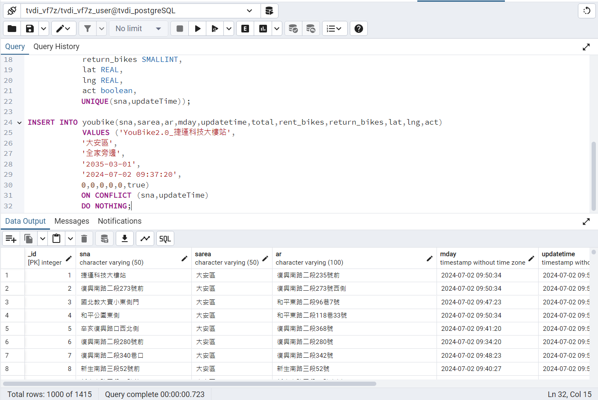

## issue276. 下載youbike的資料,進入postgreSQL的youbike的table

### [程式碼](https://github.com/TedTian0502/Ted_window/blob/main/%E9%A1%9E%E5%88%A5/HW/issue276/index.py)

---

### postgreSQL

select count(*) as 數量
from youbike

select *
from youbike

drop table if exists youbike;

CREATE TABLE IF NOT EXISTS youbike (
            _id Serial Primary Key,
            sna VARCHAR(50) NOT NULL ,
            sarea VARCHAR(50),
            ar VARCHAR(100),
            mday timestamp,
            updateTime timestamp ,
            total SMALLINT,
            rent_bikes SMALLINT,
            return_bikes SMALLINT,
            lat REAL,
            lng REAL,
            act boolean,
			UNIQUE(sna,updateTime));

INSERT INTO youbike(sna,sarea,ar,mday,updatetime,total,rent_bikes,return_bikes,lat,lng,act)
            VALUES ('YouBike2.0_捷運科技大樓站',
			'大安區',
			'全家旁邊',
			'2035-03-01',
			'2024-07-02 09:37:20',
			0,0,0,0,0,true)
			ON CONFLICT (sna,updateTime)
			DO NOTHING;

---

### pgAdmin執行成功畫面

