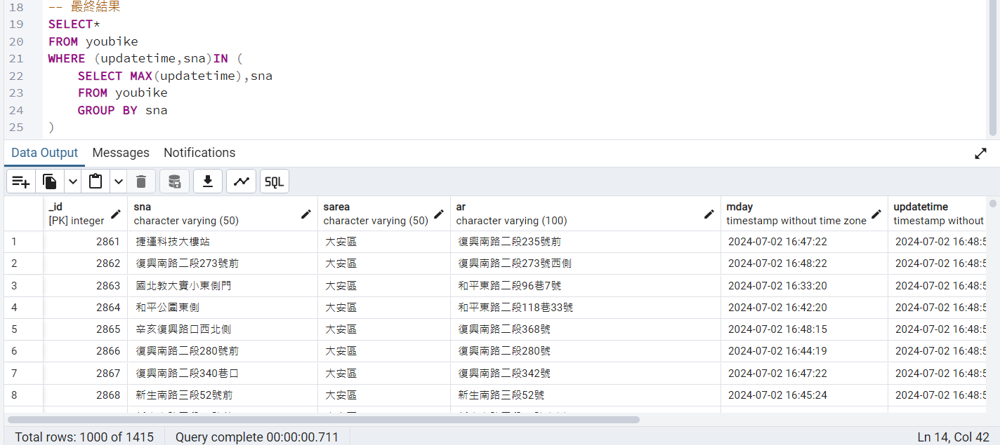

## issue293. 請取出youbike表格內,所有站點的最新資料

### postgreSQL

select count(*) as 數量  
from youbike

SELECT*  
FROM youbike  
WHERE (updatetime,sna)IN (  
	SELECT MAX(updatetime),sna  
	FROM youbike  
	GROUP BY sna
)

---

### pgAdmin執行成功畫面

